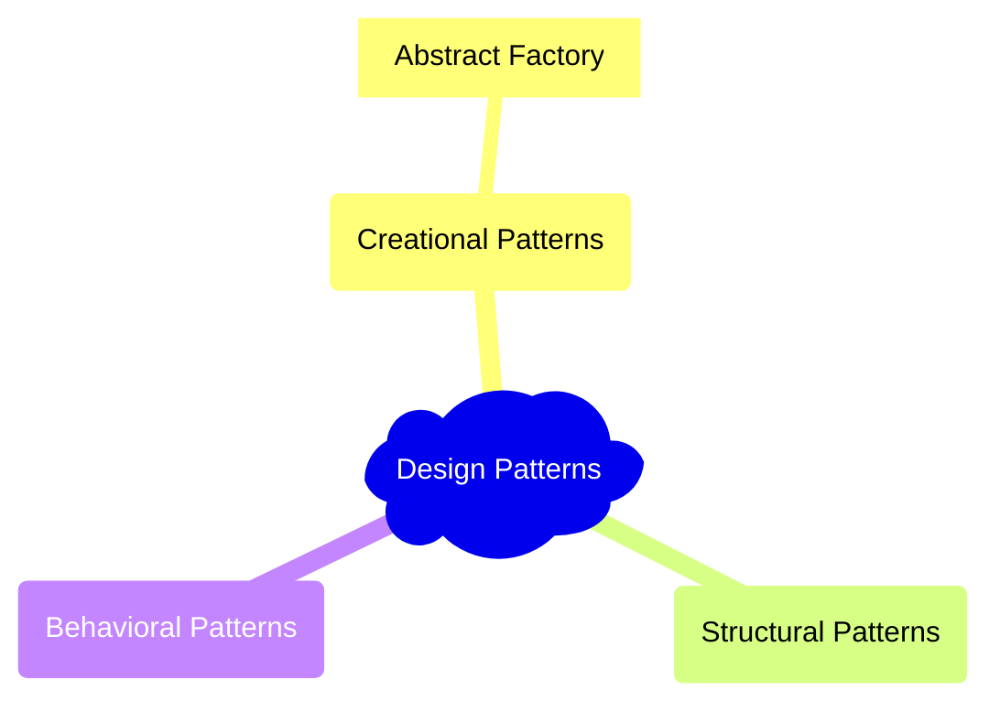

# 👷‍♀️ Design Patterns

This repo contains TypeScript examples of design patterns from the book <i>[Design Patterns: Elements of Reusable Object-Oriented Software](https://www.oreilly.com/library/view/design-patterns-elements/0201633612/)</i>

In `/src`, each pattern has its own folder with the following files:

- `notes.md` - notes + diagrams about the pattern
- `pattern.ms` - the pattern written in TypeScript
- `example.ts` - an example of using the pattern

## Current Patterns

These are the patterns that i have notes on:

**Creational**

- [AbstractFactory](https://github.com/katebrune/design-patterns/blob/main/src/abstract-factory/notes.md)
