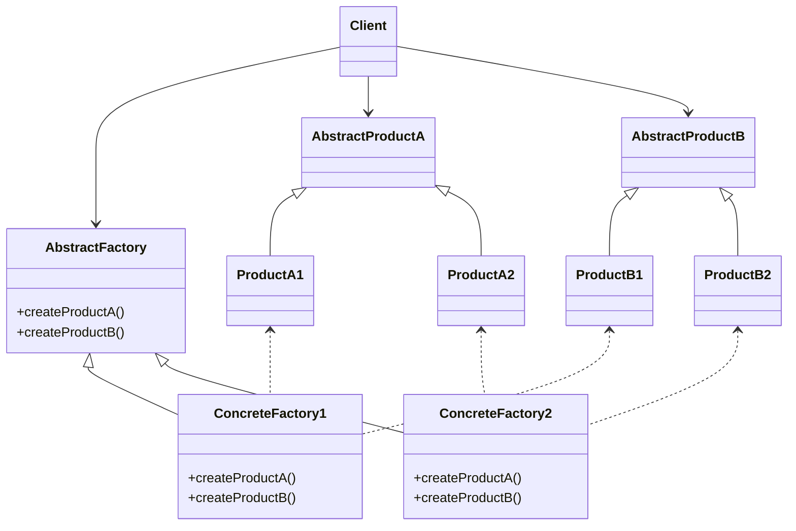
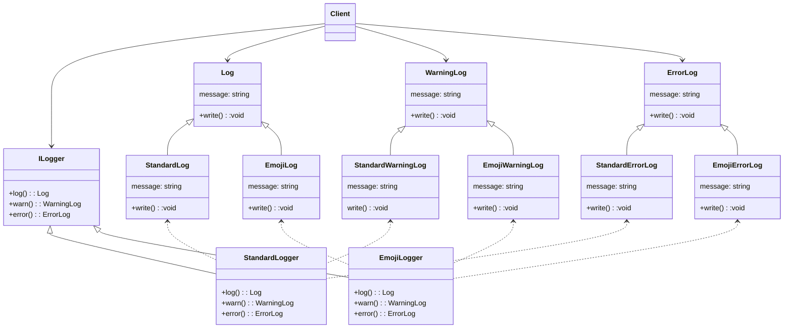

# Abstract Factory

The intent of the abstract factory pattern is to create families of related or dependent objects without specifying their concrete classes. The motivation behind this pattern is to abstract away look-and-feel standards from application logic. It's all about writing your client code to an interface instead of a concrete implementation.

This pattern is useful to apply when:

- a system should be independent of how its products are created, composed, and represented
- a system should be configured with one of multiple families of products
- a family of related product objects is designed to be used together, and you need to enforce this constraint
- you want to provide a class library of products, and you want to reveal just their interfaces, not their implementations.

## Pattern Structure

A TypeScript example of this pattern is in `pattern.ts`.

## Example Structure

In my example in `example.ts` we use the abstract factory pattern to abstract the look-and-feel standards of the logs away from the logging mechanism

