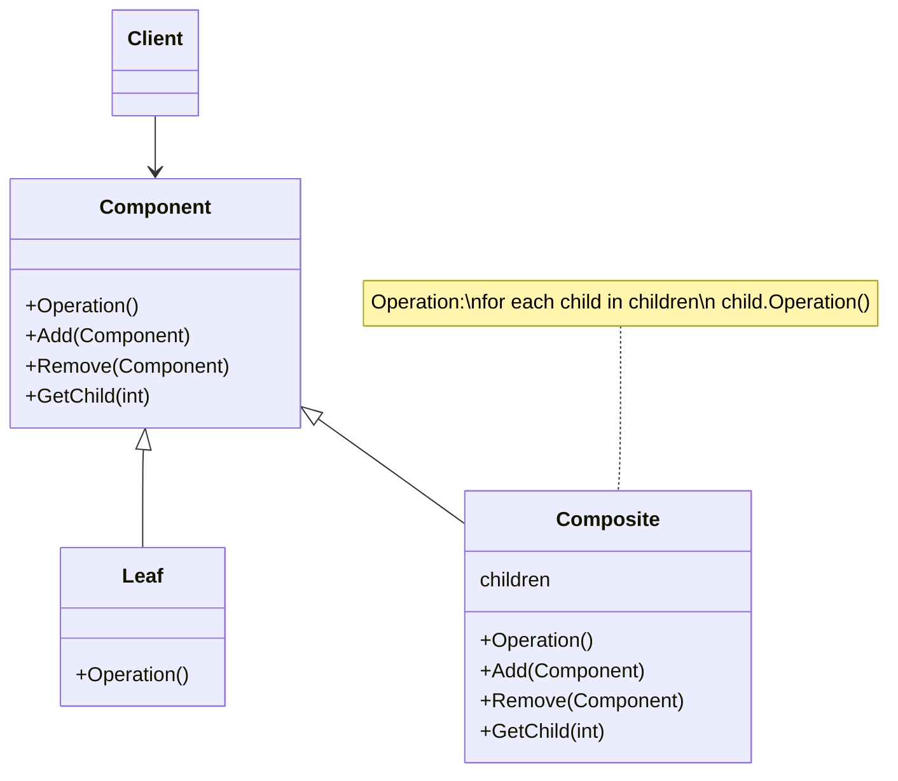

# Composite Pattern

The intent of the composite pattern is to compose objects into tree structures to represent part-whole hierarchies. Composite lets clients treat individual objects and compositions of objects uniformly. The motivation behind this pattern is to allow users to build complex components out of simple components. A good example of the composite pattern is React components - regardless if they are primitives or compositions, we use the same API to interact with them.

Use the composite pattern when:

- you want to represent part-whole hierarchies of objects
- you want clients to be able to ignore the difference between compositions of objects and individual objects. Clients will treat all objects in the composite structure uniformly.

## Pattern Structure

